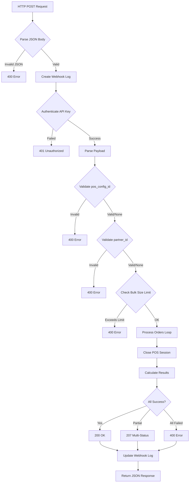
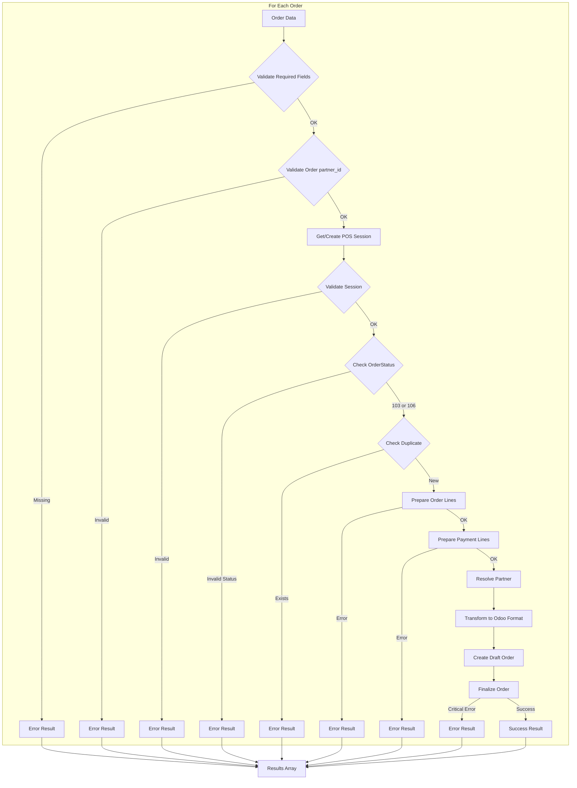
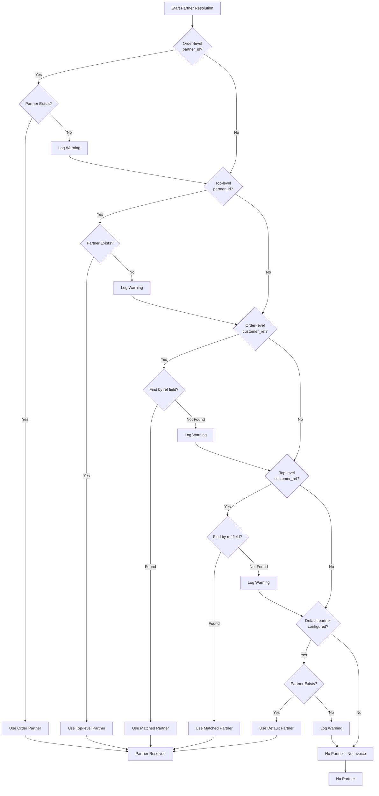
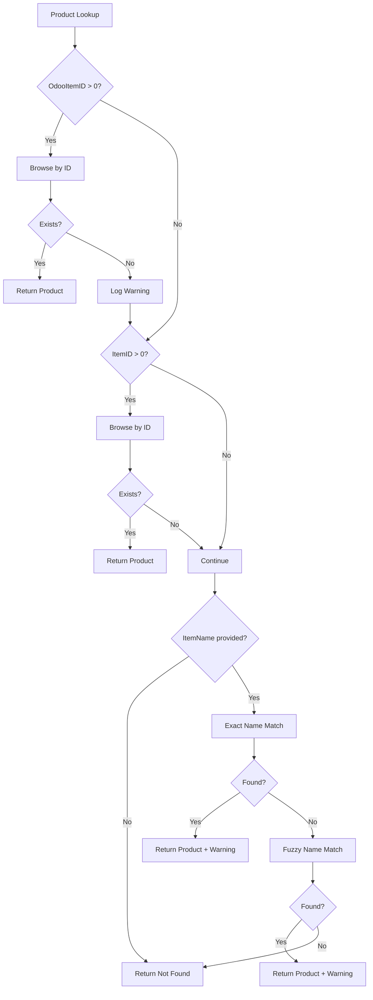
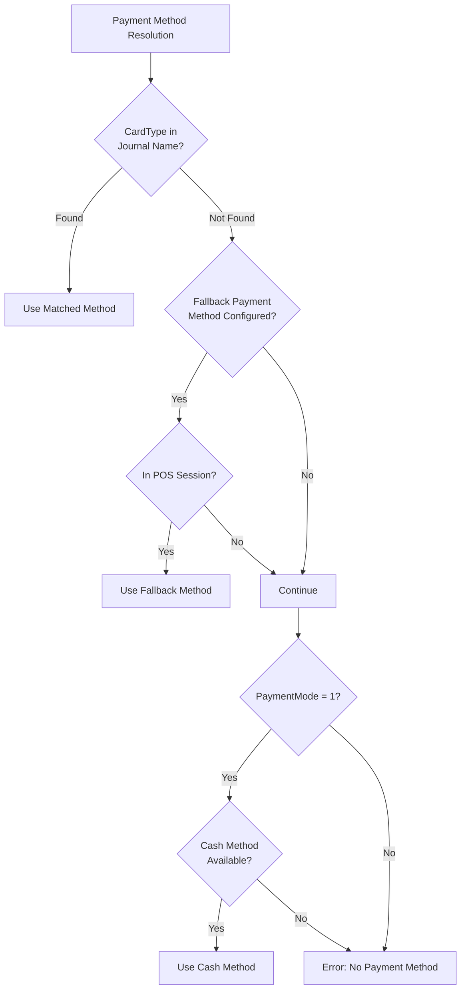
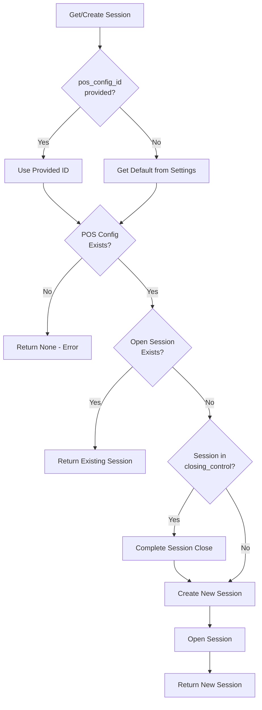
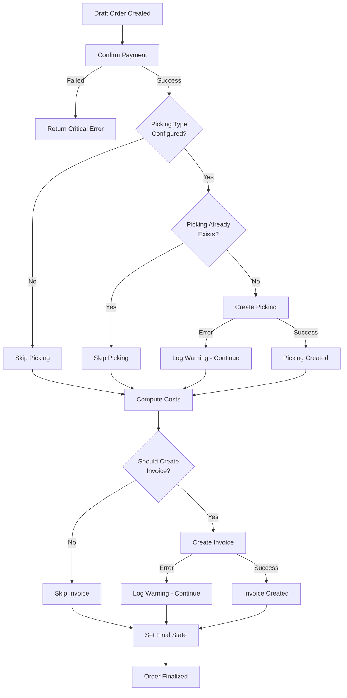

# API Controller Technical Documentation

This document explains how the Karage POS API Controller processes webhook requests to create POS orders in Odoo.

## Table of Contents

- [Architecture Overview](#architecture-overview)
- [Main Request Flow](#main-request-flow)
- [Order Processing Pipeline](#order-processing-pipeline)
- [Partner Resolution](#partner-resolution)
- [Product Lookup](#product-lookup)
- [Payment Method Matching](#payment-method-matching)
- [Session Management](#session-management)
- [Order Finalization](#order-finalization)
- [Error Handling](#error-handling)
- [Method Reference](#method-reference)

---

## Architecture Overview

```
┌─────────────────────────────────────────────────────────────────────────────┐
│                         EXTERNAL POS SYSTEM                                  │
│                    (Karage Mobile App, etc.)                                │
└─────────────────────────────────────────────────────────────────────────────┘
                                    │
                                    │ HTTP POST
                                    │ /api/v1/webhook/pos-order/bulk
                                    ▼
┌─────────────────────────────────────────────────────────────────────────────┐
│                         API CONTROLLER                                       │
│  ┌─────────────┐  ┌─────────────┐  ┌─────────────┐  ┌─────────────────────┐ │
│  │   Parse &   │  │ Authenticate│  │  Validate   │  │  Process Orders     │ │
│  │   Log       │─▶│  API Key    │─▶│   Payload   │─▶│  (Loop)             │ │
│  └─────────────┘  └─────────────┘  └─────────────┘  └─────────────────────┘ │
└─────────────────────────────────────────────────────────────────────────────┘
                                    │
                    ┌───────────────┼───────────────┐
                    ▼               ▼               ▼
            ┌─────────────┐ ┌─────────────┐ ┌─────────────┐
            │ pos.order   │ │ pos.session │ │ pos.payment │
            │             │ │             │ │             │
            │ • Create    │ │ • Get/Create│ │ • Match     │
            │ • Finalize  │ │ • Close     │ │ • Validate  │
            └─────────────┘ └─────────────┘ └─────────────┘
                    │               │               │
                    └───────────────┼───────────────┘
                                    ▼
            ┌─────────────────────────────────────────────┐
            │              ODOO DATABASE                   │
            │  ┌─────────┐ ┌─────────┐ ┌─────────────────┐│
            │  │pos.order│ │ stock.  │ │ account.move    ││
            │  │         │ │ picking │ │ (Invoice)       ││
            │  └─────────┘ └─────────┘ └─────────────────┘│
            └─────────────────────────────────────────────┘
```

---

## Main Request Flow



### Step-by-Step Process

| Step | Method | Description |
|------|--------|-------------|
| 1 | `_parse_request_body()` | Parse incoming JSON, validate format |
| 2 | `_create_webhook_log()` | Log request for debugging/idempotency |
| 3 | `_authenticate_api_key()` | Validate X-API-KEY header against Odoo |
| 4 | `_validate_pos_config_id()` | Ensure POS config exists (if provided) |
| 5 | `_validate_partner_id()` | Ensure partner exists (if provided) |
| 6 | `_process_bulk_orders()` | Process each order independently |
| 7 | `_close_and_post_session()` | Close POS session, create journal entries |
| 8 | `_update_log()` | Update webhook log with result |

---

## Order Processing Pipeline

Each order goes through this pipeline independently (failures don't affect other orders):



### Order Processing Details

```
┌─────────────────────────────────────────────────────────────────┐
│                    ORDER PROCESSING                              │
├─────────────────────────────────────────────────────────────────┤
│                                                                  │
│  ┌──────────────┐    ┌──────────────┐    ┌──────────────┐       │
│  │ OrderItems   │    │ CheckoutDet. │    │ partner_id/  │       │
│  │ (Products)   │    │ (Payments)   │    │ customer_ref │       │
│  └──────┬───────┘    └──────┬───────┘    └──────┬───────┘       │
│         │                   │                   │                │
│         ▼                   ▼                   ▼                │
│  ┌──────────────┐    ┌──────────────┐    ┌──────────────┐       │
│  │ Find Product │    │ Match Payment│    │ Resolve      │       │
│  │ by ID/Name   │    │ Method       │    │ Partner      │       │
│  └──────┬───────┘    └──────┬───────┘    └──────┬───────┘       │
│         │                   │                   │                │
│         ▼                   ▼                   ▼                │
│  ┌──────────────┐    ┌──────────────┐    ┌──────────────┐       │
│  │ Calculate    │    │ Create       │    │ Set Invoice  │       │
│  │ Taxes        │    │ Payment Line │    │ Flag         │       │
│  └──────┬───────┘    └──────┬───────┘    └──────┬───────┘       │
│         │                   │                   │                │
│         └───────────────────┼───────────────────┘                │
│                             ▼                                    │
│                    ┌──────────────────┐                          │
│                    │ Transform to     │                          │
│                    │ Odoo Format      │                          │
│                    └────────┬─────────┘                          │
│                             │                                    │
│                             ▼                                    │
│                    ┌──────────────────┐                          │
│                    │ _process_order() │                          │
│                    │ (Odoo Standard)  │                          │
│                    └────────┬─────────┘                          │
│                             │                                    │
│                             ▼                                    │
│                    ┌──────────────────┐                          │
│                    │ Finalize Order   │                          │
│                    │ • Confirm Payment│                          │
│                    │ • Create Picking │                          │
│                    │ • Create Invoice │                          │
│                    └──────────────────┘                          │
│                                                                  │
└─────────────────────────────────────────────────────────────────┘
```

---

## Partner Resolution

Partners are resolved using a priority-based lookup:



### Priority Order

| Priority | Source | Field | Lookup Method |
|----------|--------|-------|---------------|
| 1 | Order-level | `partner_id` | Direct ID browse |
| 2 | Top-level | `partner_id` | Direct ID browse |
| 3 | Order-level | `customer_ref` | Search by `ref` field |
| 4 | Top-level | `customer_ref` | Search by `ref` field |
| 5 | Settings | `karage_pos.default_partner_id` | Direct ID browse |

---

## Product Lookup

Products are found using multiple strategies:



### Product Validation

After finding a product, it must pass validation:

```
┌────────────────────────────────────────────────────────┐
│                 PRODUCT VALIDATION                      │
├────────────────────────────────────────────────────────┤
│                                                         │
│   ┌─────────────────┐                                  │
│   │ Product Found   │                                  │
│   └────────┬────────┘                                  │
│            │                                           │
│            ▼                                           │
│   ┌─────────────────┐     ┌──────────────────────────┐│
│   │ Active?         │─No─▶│ Error: Product inactive  ││
│   └────────┬────────┘     └──────────────────────────┘│
│            │Yes                                        │
│            ▼                                           │
│   ┌─────────────────┐     ┌──────────────────────────┐│
│   │ sale_ok?        │─No─▶│ Error: Not for sale      ││
│   │ (if required)   │     │ (configurable)           ││
│   └────────┬────────┘     └──────────────────────────┘│
│            │Yes                                        │
│            ▼                                           │
│   ┌─────────────────┐     ┌──────────────────────────┐│
│   │ available_in_pos│─No─▶│ Error: Not in POS        ││
│   │ (if required)   │     │ (configurable)           ││
│   └────────┬────────┘     └──────────────────────────┘│
│            │Yes                                        │
│            ▼                                           │
│   ┌─────────────────┐     ┌──────────────────────────┐│
│   │ Same company?   │─No─▶│ Error: Wrong company     ││
│   │ (if required)   │     │ (configurable)           ││
│   └────────┬────────┘     └──────────────────────────┘│
│            │Yes                                        │
│            ▼                                           │
│   ┌─────────────────┐                                  │
│   │ Product Valid   │                                  │
│   └─────────────────┘                                  │
│                                                         │
└────────────────────────────────────────────────────────┘
```

---

## Payment Method Matching



### Matching Logic Detail

```
┌─────────────────────────────────────────────────────────────────┐
│              PAYMENT METHOD MATCHING                             │
├─────────────────────────────────────────────────────────────────┤
│                                                                  │
│  Input: PaymentMode=2, CardType="Visa"                          │
│                                                                  │
│  ┌────────────────────────────────────────────────────────────┐ │
│  │ STRATEGY 1: CardType in Journal Name                       │ │
│  ├────────────────────────────────────────────────────────────┤ │
│  │                                                            │ │
│  │  POS Session Payment Methods:                              │ │
│  │  ┌──────────────────────────────────────────────────┐     │ │
│  │  │ Method: "Karage - Cash"    Journal: "Cash"       │ ✗   │ │
│  │  │ Method: "Karage - Visa"    Journal: "Visa Card"  │ ✓   │ │
│  │  │ Method: "Karage - Bank"    Journal: "Bank"       │ ✗   │ │
│  │  └──────────────────────────────────────────────────┘     │ │
│  │                                                            │ │
│  │  "visa".lower() in "Visa Card".lower() → TRUE             │ │
│  │                                                            │ │
│  └────────────────────────────────────────────────────────────┘ │
│                                                                  │
│  ┌────────────────────────────────────────────────────────────┐ │
│  │ STRATEGY 2: Fallback Payment Method (if Strategy 1 fails) │ │
│  ├────────────────────────────────────────────────────────────┤ │
│  │                                                            │ │
│  │  Config: karage_pos.fallback_payment_method_id = 5        │ │
│  │  → Browse payment method ID 5                              │ │
│  │  → Check if it's in the POS session                       │ │
│  │                                                            │ │
│  └────────────────────────────────────────────────────────────┘ │
│                                                                  │
│  ┌────────────────────────────────────────────────────────────┐ │
│  │ STRATEGY 3: Cash for PaymentMode=1 (if others fail)       │ │
│  ├────────────────────────────────────────────────────────────┤ │
│  │                                                            │ │
│  │  If PaymentMode == 1:                                      │ │
│  │    Find method where is_cash_count = True                  │ │
│  │                                                            │ │
│  └────────────────────────────────────────────────────────────┘ │
│                                                                  │
└─────────────────────────────────────────────────────────────────┘
```

---

## Session Management



### Session Lifecycle

```
┌─────────────────────────────────────────────────────────────────┐
│                    SESSION LIFECYCLE                             │
├─────────────────────────────────────────────────────────────────┤
│                                                                  │
│  ┌──────────────┐                                               │
│  │ Webhook      │                                               │
│  │ Request      │                                               │
│  └──────┬───────┘                                               │
│         │                                                        │
│         ▼                                                        │
│  ┌──────────────┐    ┌──────────────┐    ┌──────────────┐       │
│  │ Check for    │───▶│ Found?       │───▶│ Use Existing │       │
│  │ Open Session │    │              │Yes │ Session      │       │
│  └──────────────┘    └──────┬───────┘    └──────────────┘       │
│                             │No                                  │
│                             ▼                                    │
│                      ┌──────────────┐    ┌──────────────┐       │
│                      │ Check for    │───▶│ Close It     │       │
│                      │ Closing Sess │Yes │              │       │
│                      └──────┬───────┘    └──────┬───────┘       │
│                             │No                 │                │
│                             ▼                   ▼                │
│                      ┌──────────────┐                            │
│                      │ Create New   │                            │
│                      │ Session      │                            │
│                      └──────┬───────┘                            │
│                             │                                    │
│                             ▼                                    │
│  ┌──────────────────────────────────────────────────────────┐   │
│  │                  PROCESS ORDERS                           │   │
│  │  Order 1 ─────▶ Order 2 ─────▶ ... ─────▶ Order N        │   │
│  └──────────────────────────────────────────────────────────┘   │
│                             │                                    │
│                             ▼                                    │
│  ┌──────────────┐    ┌──────────────┐    ┌──────────────┐       │
│  │ Close Session│───▶│ Create       │───▶│ Mark Session │       │
│  │              │    │ Journal Entry│    │ Closed       │       │
│  └──────────────┘    └──────────────┘    └──────────────┘       │
│                                                                  │
└─────────────────────────────────────────────────────────────────┘
```

---

## Order Finalization

After creating the draft order, finalization handles payment, inventory, and invoicing:



### Invoice Decision Logic

```
┌─────────────────────────────────────────────────────────────────┐
│                 INVOICE CREATION DECISION                        │
├─────────────────────────────────────────────────────────────────┤
│                                                                  │
│  Should Invoice = ALL of the following must be TRUE:            │
│                                                                  │
│  ┌─────────────────────────────────────────────────────────┐    │
│  │  to_invoice == True                                      │    │
│  │  (Set when partner is resolved)                          │    │
│  └─────────────────────────────────────────────────────────┘    │
│                         AND                                      │
│  ┌─────────────────────────────────────────────────────────┐    │
│  │  state IN ('paid', 'done', 'invoiced')                   │    │
│  │  (Order is in a completed state)                         │    │
│  └─────────────────────────────────────────────────────────┘    │
│                         AND                                      │
│  ┌─────────────────────────────────────────────────────────┐    │
│  │  partner_id EXISTS                                       │    │
│  │  (Customer assigned to order)                            │    │
│  └─────────────────────────────────────────────────────────┘    │
│                         AND                                      │
│  ┌─────────────────────────────────────────────────────────┐    │
│  │  account_move IS EMPTY                                   │    │
│  │  (Invoice doesn't already exist)                         │    │
│  └─────────────────────────────────────────────────────────┘    │
│                                                                  │
│  If ALL conditions TRUE → Create Invoice                        │
│  If ANY condition FALSE → Skip Invoice                          │
│                                                                  │
└─────────────────────────────────────────────────────────────────┘
```

---

## Error Handling

The controller uses a resilient error handling strategy:

```
┌─────────────────────────────────────────────────────────────────┐
│                    ERROR HANDLING STRATEGY                       │
├─────────────────────────────────────────────────────────────────┤
│                                                                  │
│  CRITICAL ERRORS (Stop Processing):                             │
│  ┌─────────────────────────────────────────────────────────┐    │
│  │ • Invalid JSON format                                    │    │
│  │ • Authentication failure                                 │    │
│  │ • Invalid pos_config_id or partner_id                   │    │
│  │ • Payment confirmation failure                           │    │
│  └─────────────────────────────────────────────────────────┘    │
│                                                                  │
│  ORDER-LEVEL ERRORS (Fail Single Order):                        │
│  ┌─────────────────────────────────────────────────────────┐    │
│  │ • Missing required fields                                │    │
│  │ • Invalid OrderStatus                                    │    │
│  │ • Duplicate order detected                               │    │
│  │ • Product not found                                      │    │
│  │ • Payment method not found                               │    │
│  └─────────────────────────────────────────────────────────┘    │
│                                                                  │
│  NON-CRITICAL ERRORS (Log & Continue):                          │
│  ┌─────────────────────────────────────────────────────────┐    │
│  │ • Picking creation failure                               │    │
│  │ • Invoice creation failure                               │    │
│  │ • Cost computation failure                               │    │
│  │ • Session closing failure                                │    │
│  └─────────────────────────────────────────────────────────┘    │
│                                                                  │
│  Each order uses a SAVEPOINT for atomic processing:             │
│                                                                  │
│    with request.env.cr.savepoint():                             │
│        # If error occurs, only this order rolls back            │
│        # Other orders continue processing                        │
│                                                                  │
└─────────────────────────────────────────────────────────────────┘
```

---

## Method Reference

### Main Endpoint

| Method | Line | Description |
|--------|------|-------------|
| `webhook_pos_order_bulk()` | 209 | Main HTTP endpoint handler |

### Request Processing

| Method | Line | Description |
|--------|------|-------------|
| `_parse_request_body()` | 46 | Parse and validate JSON body |
| `_authenticate_api_key()` | 120 | Validate API key against Odoo |
| `_validate_pos_config_id()` | 153 | Validate POS config exists |
| `_validate_partner_id()` | 176 | Validate partner exists |
| `_json_response()` | 98 | Create standardized JSON response |

### Order Processing

| Method | Line | Description |
|--------|------|-------------|
| `_process_bulk_orders()` | 401 | Loop through and process all orders |
| `_process_pos_order()` | 809 | Process single order end-to-end |
| `_transform_to_odoo_format()` | 620 | Convert webhook data to Odoo format |
| `_finalize_order()` | 722 | Confirm payment, create picking/invoice |

### Product Handling

| Method | Line | Description |
|--------|------|-------------|
| `_find_product_by_id()` | 1263 | Main product lookup orchestrator |
| `_find_product_by_direct_id()` | 1210 | Lookup by OdooItemID or ItemID |
| `_find_product_by_name()` | 1225 | Lookup by exact/fuzzy name match |
| `_validate_product_for_pos()` | 1331 | Validate product flags |
| `_prepare_order_lines()` | 1367 | Create order lines with tax calculation |

### Payment Handling

| Method | Line | Description |
|--------|------|-------------|
| `_resolve_payment_method()` | 1482 | Main payment method resolver |
| `_find_payment_method_by_card_type()` | 1459 | Match CardType to journal name |
| `_find_payment_method_by_fallback()` | 1467 | Use configured fallback method |
| `_find_cash_payment_method()` | 1476 | Find cash method for PaymentMode=1 |
| `_prepare_payment_lines()` | 1517 | Create payment lines |

### Partner Handling

| Method | Line | Description |
|--------|------|-------------|
| `_resolve_partner()` | 548 | Multi-strategy partner resolution |

### Session Management

| Method | Line | Description |
|--------|------|-------------|
| `_get_or_create_external_session()` | 956 | Get open session or create new |
| `_get_current_external_session()` | 1060 | Get session without creating |
| `_close_and_post_session()` | 1095 | Close session and create journal entry |
| `_force_close_session()` | 1152 | Force close stuck sessions |
| `_validate_pos_session()` | 480 | Validate session has payment methods |

### Validation

| Method | Line | Description |
|--------|------|-------------|
| `_check_duplicate_order()` | 504 | Check if OrderID already exists |
| `_validate_order_status()` | 521 | Validate against allowed statuses |

### Logging

| Method | Line | Description |
|--------|------|-------------|
| `_create_webhook_log()` | 56 | Create webhook log entry |
| `_update_log()` | 74 | Update log with result |

### Utilities

| Method | Line | Description |
|--------|------|-------------|
| `_get_header_or_body()` | 23 | Extract value from headers or body |
| `_parse_order_datetime()` | 604 | Parse ISO datetime to UTC |
| `_is_picking_config_valid()` | 703 | Check picking type configuration |
| `_get_payment_config()` | 1500 | Get payment fallback settings |
| `_get_product_validation_config()` | 1296 | Get product validation settings |

---

## Data Flow Summary

```
┌─────────────────────────────────────────────────────────────────┐
│                     COMPLETE DATA FLOW                           │
├─────────────────────────────────────────────────────────────────┤
│                                                                  │
│  EXTERNAL POS                                                    │
│       │                                                          │
│       │  POST /api/v1/webhook/pos-order/bulk                    │
│       │  X-API-KEY: xxxxx                                        │
│       │  {                                                       │
│       │    "pos_config_id": 5,                                  │
│       │    "partner_id": 15,                                    │
│       │    "orders": [...]                                      │
│       │  }                                                       │
│       ▼                                                          │
│  ┌─────────────────────────────────────────────────────────┐    │
│  │                  API CONTROLLER                          │    │
│  │                                                          │    │
│  │  1. Parse JSON ─────────────────────────────────────┐   │    │
│  │  2. Create Webhook Log                               │   │    │
│  │  3. Authenticate API Key                             │   │    │
│  │  4. Validate pos_config_id, partner_id              │   │    │
│  │  5. For each order:                                  │   │    │
│  │     ├── Validate fields                              │   │    │
│  │     ├── Get/Create POS Session                       │   │    │
│  │     ├── Check duplicate                              │   │    │
│  │     ├── Find products ──────────────────────────────┼───┼────│
│  │     ├── Calculate taxes                              │   │    │
│  │     ├── Match payment methods ──────────────────────┼───┼────│
│  │     ├── Resolve partner ────────────────────────────┼───┼────│
│  │     ├── Create draft order                          │   │    │
│  │     └── Finalize (payment, picking, invoice)        │   │    │
│  │  6. Close POS Session                                │   │    │
│  │  7. Return results                                   │   │    │
│  │                                                      ▼   │    │
│  └─────────────────────────────────────────────────────────┘    │
│                                                                  │
│  ┌─────────────────────────────────────────────────────────┐    │
│  │                    ODOO DATABASE                         │    │
│  │                                                          │    │
│  │  pos.order ──────────────────────────────────────────   │    │
│  │  │  • external_order_id = "12345"                        │    │
│  │  │  • external_order_source = "karage_pos_webhook"       │    │
│  │  │  • partner_id = 15                                    │    │
│  │  │  • amount_total = 115.00                              │    │
│  │  │                                                       │    │
│  │  ├── pos.order.line ─────────────────────────────────   │    │
│  │  │   • product_id = 35722                                │    │
│  │  │   • qty = 2                                           │    │
│  │  │   • price_unit = 50.00                                │    │
│  │  │                                                       │    │
│  │  ├── pos.payment ────────────────────────────────────   │    │
│  │  │   • payment_method_id = 5 (Visa)                      │    │
│  │  │   • amount = 115.00                                   │    │
│  │  │                                                       │    │
│  │  ├── stock.picking (Inventory) ──────────────────────   │    │
│  │  │   • Deducts stock from warehouse                      │    │
│  │  │                                                       │    │
│  │  └── account.move (Invoice) ─────────────────────────   │    │
│  │      • Customer invoice for partner_id = 15              │    │
│  │                                                          │    │
│  └─────────────────────────────────────────────────────────┘    │
│                                                                  │
│       │                                                          │
│       │  Response:                                               │
│       │  {                                                       │
│       │    "status": "success",                                 │
│       │    "data": {                                            │
│       │      "total": 1,                                        │
│       │      "successful": 1,                                   │
│       │      "results": [...]                                   │
│       │    }                                                    │
│       │  }                                                       │
│       ▼                                                          │
│  EXTERNAL POS                                                    │
│                                                                  │
└─────────────────────────────────────────────────────────────────┘
```
